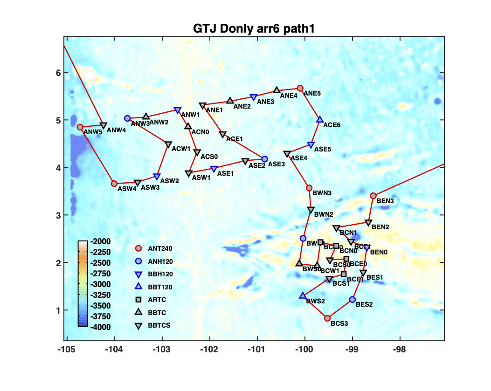

The study region for this experiment encompasses a region across the Galapagos triple junction, where both the East Pacific Rise and Cocos-Nazca ridges meet. The networks of ocean-bottom seismometers being deployed include a zone of relatively dense coverage overlying the Cocos-Nazca ridge, which is in a stage of active rift initiation at longitudes near approx. 101.8 W. Northwards, our network of stations span a region oriented ENE, perpendicular to the Pacific-Cocos Ridge. 

The map above shows the route of the GTJ OBS deployment. The color of the line corresponds to along-path distance in kilometers, and the background color shows bathymetry, with yellower colors corresponding to shallower bathymetry; the yellowest regions highlight the Pacific-Cocos Ridge and the Cocos-Nazca ridge. Red triangles correspond to OBS locations. 

  
<strong>Share this page:</strong>

  
  
  

[← Back to Home](/)
